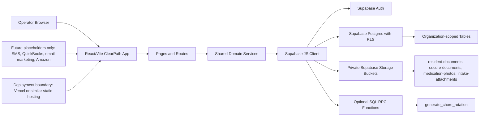

# ClearPath

ClearPath is a React/Vite operations app for sober-living and recovery housing teams. It is wired to Supabase for Auth, Postgres data, Row Level Security, and private Storage.

This project is a compliance-ready foundation, not a HIPAA-compliant finished system. Any production launch that handles protected health information still needs legal, policy, security, and vendor review.

## Current Status

- Frontend: React, Vite, React Router, React Query, Tailwind, Radix/shadcn-style components.
- Backend: Supabase Postgres, Supabase Auth, Supabase Storage.
- Data access: browser-safe Supabase client in `src/lib/supabaseClient.js`.
- Domain services: `src/services/*`.
- Database schema: `supabase/migrations/20260516015100_initial_clearpath_schema.sql`.
- Removable MVP sample data: `scripts/sample-data/*` and `docs/sample-data.md`.
- External integrations such as SMS, QuickBooks, email marketing, and Amazon ordering are placeholders only.

## Architecture



## Setup Commands

Run these from the project directory:

```bash
cd /Users/chrixcolvard/projects/clients/recovery-centered-living/clearpath-production-2
npm install
cp .env.example .env.local
```

Edit `.env.local`:

```bash
VITE_SUPABASE_URL=https://your-project-ref.supabase.co
VITE_SUPABASE_PUBLISHABLE_KEY=sb_publishable_your_publishable_key
VITE_DEMO_ORGANIZATION_ID=00000000-0000-4000-8000-000000000001
VITE_AUTH_BYPASS=false
VITE_CLEARPATH_DEMO_MODE=false
```

Use only the Supabase publishable key in `.env.local`. Do not put a secret key or service role key in any frontend `.env` file.

For local debugging only, `VITE_AUTH_BYPASS=true` skips the login screen and uses a demo owner identity with temporary in-memory demo records in development mode. Keep it `false` for deployed environments.

For temporary hosted UI/UX testing only, `VITE_CLEARPATH_DEMO_MODE=true` opens the fake sample-data workspace in production builds. Keep it `false` before real users or real resident data are used.

See `docs/auth-bypass-dependency-report.md` for the current auth/debugging findings.

## Supabase Local Setup

Install the Supabase CLI first if it is not already installed:

```bash
brew install supabase/tap/supabase
```

Then run:

```bash
supabase init
supabase start
supabase db reset
```

The migration files are already present. `supabase db reset` applies `supabase/migrations/*.sql`. The default `supabase/seed.sql` intentionally does not create untagged demo data.

For an existing hosted Supabase project, apply the migration through the Supabase dashboard SQL editor or the Supabase CLI after linking the project.

## MVP Sample Data

Use the tagged sample-data workflow when you need end-to-end UI/UX test records:

```bash
cp .env.sample-data.example .env.sample-data.local
npm run sample:seed
npm run sample:attach-user -- --email cricks@the1322.com --role owner --batch latest
npm run sample:validate
```

The `.env.sample-data.local` file must use server-side Supabase credentials only:

```bash
SUPABASE_URL=https://your-project-ref.supabase.co
SUPABASE_SERVICE_ROLE_KEY=your-server-side-service-role-or-secret-key
```

Never put a service role or secret key in a `VITE_` variable.

Before compliance certification, remove every tagged sample row and sample file with one command:

```bash
npm run sample:remove -- --confirm --batch latest
npm run sample:validate -- --expect-empty
```

See `docs/sample-data.md` for the feature coverage, cleanup behavior, and UI smoke check.

## Development Server

```bash
npm run dev
```

Open the printed Vite URL in a browser, usually:

```bash
open http://localhost:5173
```

Create the first user from the ClearPath login screen. The first authenticated user can claim the seeded demo organization as `owner` through the included `bootstrap_organization_owner` RPC. After the first owner exists, add later users through `organization_members` or a future invite/admin screen.

Check that Vite is responding:

```bash
curl -I http://localhost:5173
```

Expected result: an HTTP `200 OK` or Vite HTML response.

## Verification Commands

```bash
npm test
npm run lint
npm run typecheck
npm run build
# Requires .env.sample-data.local and a seeded sample batch:
npm run sample:validate
```

Run a final dependency scan for any legacy backend provider names before release. Expected result: no matches.

## Dependency Map

- `@supabase/supabase-js`: browser-safe Auth, database, RPC, and Storage client.
- Supabase Postgres: source of truth for organizations, locations, residents, medications, incidents, staff, training, documents, inventory, compliance, and placeholder integration settings.
- Supabase Row Level Security: organization-scoped access control for public tables.
- Supabase Storage: private buckets for resident documents, secure documents, medication photos, and intake attachments.
- React Query: frontend data loading and cache behavior.
- React Router: app navigation.
- Tailwind and Radix/shadcn-style UI: existing app interface.

## What Slade Has In Plain English

Slade has the shell of a serious recovery-housing operations system. It already has screens and data areas for residents, staff, houses/locations, incidents, medications, documents, compliance, training, scheduling, inventory, and owner visibility.

The old app platform layer has been replaced with Supabase, which means ClearPath can now have its own database, login system, secure file storage, and permission rules instead of depending on the previous generated backend.

What is real now:

- A working React web app structure.
- A Supabase database plan with the main tables needed for sober-living operations.
- Security rules turned on at the database level.
- Private file buckets planned for sensitive documents and medication photos.
- Service files in the app that talk to Supabase instead of the old generated backend.
- Placeholder areas for future integrations without buying or wiring them too early.

What Slade still needs before production:

- A real Supabase project owned by the business.
- Real user accounts and organization membership rows.
- A policy decision for who can see, edit, export, and delete each kind of record.
- A privacy/security review before storing sensitive health or resident information.
- Production hosting, usually Vercel or similar.
- A real domain name.
- Backup/export procedures.
- Written operating policies for staff use.
- Actual vendor decisions only after the core app is stable.

What Slade should not buy yet:

- QuickBooks integration before billing workflows are proven.
- SMS automation before consent, message templates, and emergency rules are clear.
- Email marketing tools before the resident/staff communication model is decided.
- Amazon ordering automation before inventory approval workflows are working.
- Extra AI tools before the data model and permissions are stable.

## New Repo Workflow

This clone can be modified locally without changing the original source repository. When ready, create a new GitHub repository and push this working copy there:

```bash
git remote -v
git remote set-url origin https://github.com/[FILL: owner]/[FILL: new-repo].git
git push -u origin main
```

Use a new repository URL for the final push so the original repo remains untouched.
